This is a [Next.js](https://nextjs.org) project bootstrapped with [`create-next-app`](https://nextjs.org/docs/app/api-reference/cli/create-next-app).

## Getting Started

First, run the development server:

```bash
npm run dev
# or
yarn dev
# or
pnpm dev
# or
bun dev
```

Open [http://localhost:3000](http://localhost:3000) with your browser to see the result.

You can start editing the page by modifying `app/page.tsx`. The page auto-updates as you edit the file.

This project uses [`next/font`](https://nextjs.org/docs/app/building-your-application/optimizing/fonts) to automatically optimize and load [Geist](https://vercel.com/font), a new font family for Vercel.

|           |Pemrograman Berbasis Framework 2025    |
|-----------|---------------------------------------|
|Nama       | Faradilla Roudhotul Sa'naa            |
|NIM        | 2241720205                            |
|Kelas      | TI - 3A                               |


# Laporan Pertemuan 1 - Pengantar Pemrograman Berbasis Framework dan ReactsJS
### Jawaban Pertanyaan Praktikum 1 
##### 1. Jelaskan kegunaan masing-masing dari Git, VS Code dan NodeJS yang telah Anda install pada sesi praktikum ini!
**Jawab:**
- Git: digunakan untuk mengelola versi kode, memungkinkan kolaborasi tim, serta melacak perubahan dalam proyek pengembangan perangkat lunak.
- VS Code: adalah editor kode yang ringan namun powerful dengan berbagai fitur seperti debugging, ekstensi, dan integrasi Git untuk mempermudah pengembangan.
- NodeJS: memungkinkan eksekusi JavaScript di luar browser, sering digunakan untuk membangun server, aplikasi web, dan berbagai alat pengembangan.
##### 2. Buktikan dengan screenshoot yang menunjukkan bahwa masing-masing tools tersebut telah berhasil terinstall di perangkat Anda!
**Jawab:**
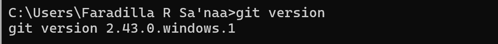
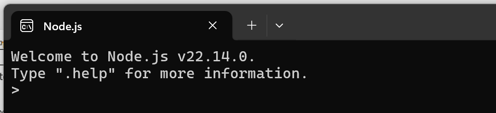
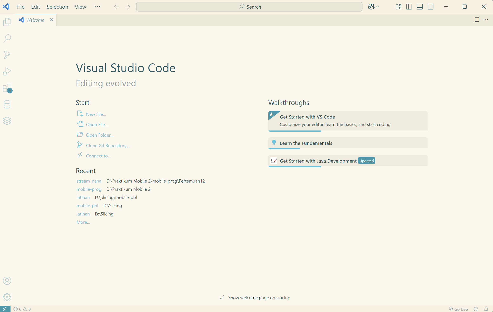

### Jawaban Pertanyaan Praktikum 2
##### 1. Pada Langkah ke-2, setelah membuat proyek baru menggunakan Next.js, terdapat beberapa istilah yang muncul. Jelaskan istilah tersebut, TypeScript, ESLint, Tailwind CSS, App Router, Import alias, App router, dan Turbopack!
**Jawab:** 
- TypeScript: adalah bahasa pemrograman berbasis JavaScript yang menambahkan tipe data untuk meningkatkan keandalan dan kemudahan debugging.
- ESLint: adalah alat yang membantu mendeteksi dan memperbaiki kesalahan dalam kode JavaScript atau TypeScript sesuai dengan standar yang ditentukan.
- Tailwind CSS: adalah framework CSS yang memungkinkan pembuatan desain yang cepat dengan menggunakan class utility langsung di dalam HTML atau JSX.
- App Router: adalah sistem routing di Next.js yang memungkinkan navigasi antar halaman dengan lebih efisien menggunakan file dan folder di dalam direktori app.
- Import alias: adalah fitur yang memungkinkan penulisan path impor yang lebih pendek dan mudah dibaca dengan mendefinisikan alias dalam konfigurasi proyek.
- Turbopack: adalah bundler modern yang lebih cepat dibandingkan Webpack, digunakan untuk mempercepat proses pengembangan dan build aplikasi Next.js.
##### 2. Apa saja kegunaan folder dan file yang ada pada struktur proyek React yang tampil pada gambar pada tahap percobaan ke-3!
**Jawab:** 
- .next: Folder build yang dihasilkan oleh Next.js, berisi file hasil kompilasi dan caching.
- node_modules: Berisi semua dependensi atau library yang diinstal melalui npm atau yarn.
- public: Folder untuk menyimpan aset statis seperti gambar, ikon, dan font yang dapat diakses langsung dari browser.
- src/app/ : Direktori utama untuk file terkait halaman dan layout dalam sistem routing berbasis App Router di Next.js.
- .gitignore : Menentukan file atau folder yang harus diabaikan oleh Git (misalnya node_modules/ dan .next/).
- eslint.config.mjs : Konfigurasi ESLint untuk memastikan kualitas kode tetap konsisten.
- next-env.d.ts : File deklarasi TypeScript yang dihasilkan secara otomatis untuk mendukung TypeScript dalam proyek Next.js.
- next.config.ts : File konfigurasi utama untuk Next.js, misalnya untuk mengatur custom server atau fitur tertentu.
- package-lock.json : File yang mengunci versi pasti dari dependensi yang diinstal untuk memastikan konsistensi di semua lingkungan.
- package.json : Berisi informasi proyek, dependensi, skrip, dan metadata lainnya untuk manajemen proyek dengan npm atau yarn.
- postcss.config.mjs : Konfigurasi PostCSS yang digunakan bersama Tailwind CSS atau plugin CSS lainnya.
- README.md : Dokumentasi proyek yang biasanya berisi petunjuk instalasi dan penggunaan.
- tailwind.config.ts : Konfigurasi untuk Tailwind CSS, seperti menyesuaikan tema atau menambahkan custom styling.
- tsconfig.json : Konfigurasi untuk TypeScript, menentukan aturan kompilasi dan pengaturan tipe dalam proyek.
##### 3. Buktikan dengan screenshoot yang menunjukkan bahwa tahapan percobaan di atas telah berhasil Anda lakukan!
**Jawab:**
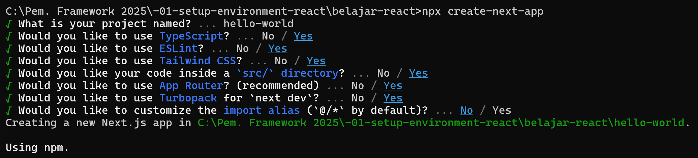
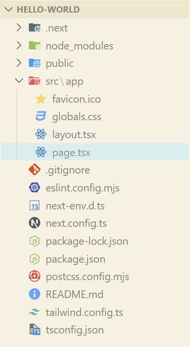
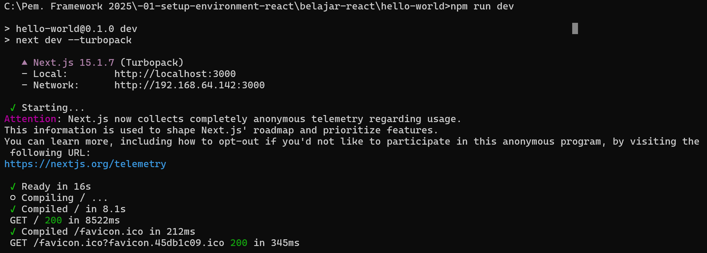
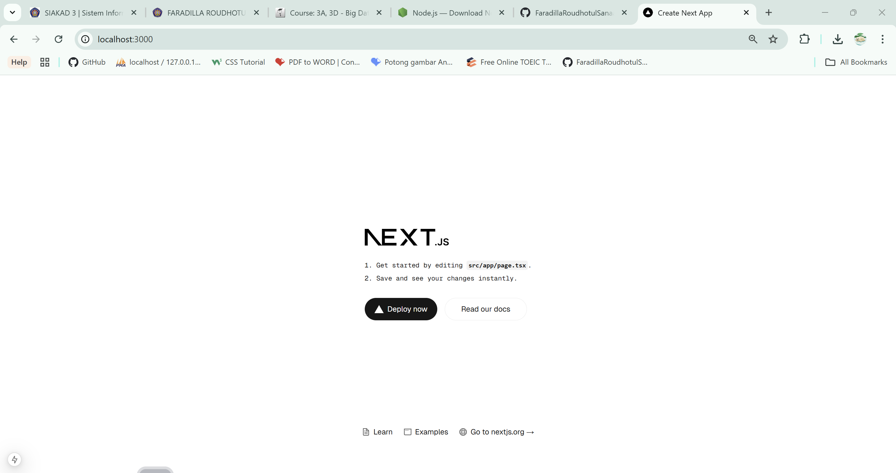

### Jawaban Pertanyaan Praktikum 3
##### 1. Buktikan dengan screenshoot yang menunjukkan bahwa tahapan percobaan di atas telah berhasil Anda lakukan! 
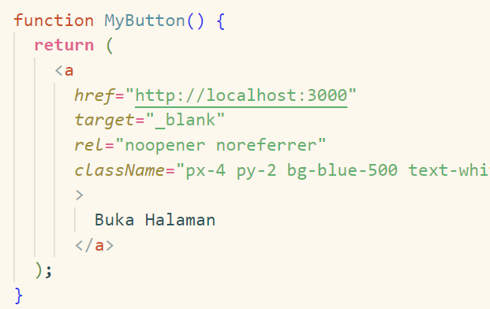
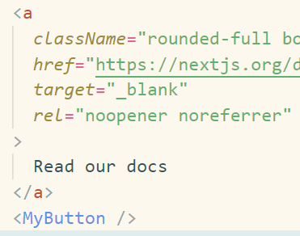
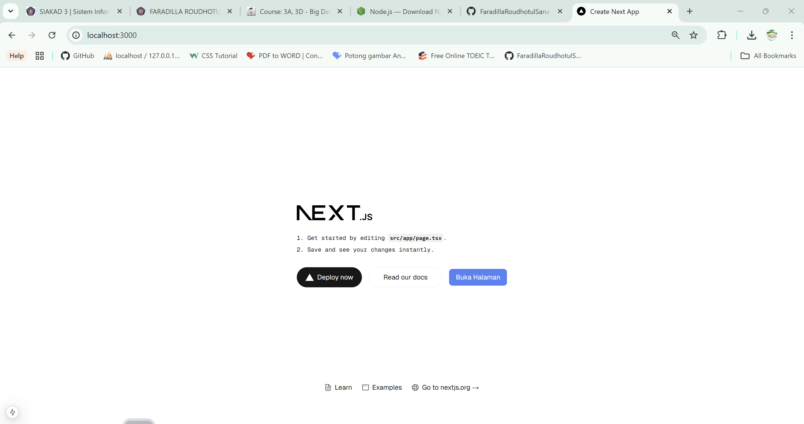

### Jawaban Pertanyaan Praktikum 4 
##### 1. Untuk apakah kegunaan sintaks user.imageUrl?
**Jawab:** Sintaks tersebut digunakan untuk mengakses URL gambar profil atau avatar dari objek user, sehingga gambar tersebut bisa ditampilkan di antarmuka aplikasi atau website.
##### 2. Buktikan dengan screenshoot yang menunjukkan bahwa tahapan percobaan di atas telah berhasil Anda lakukan! 
**Jawab:**
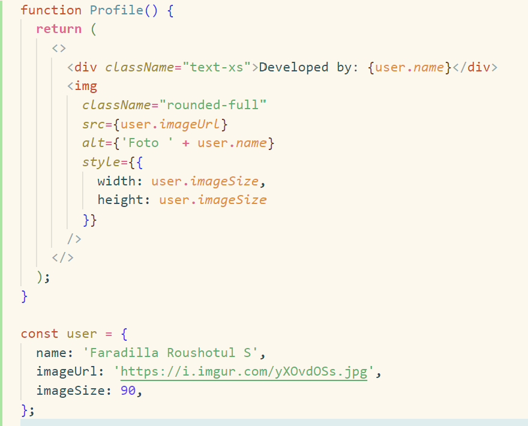
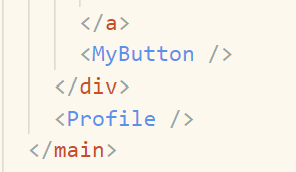
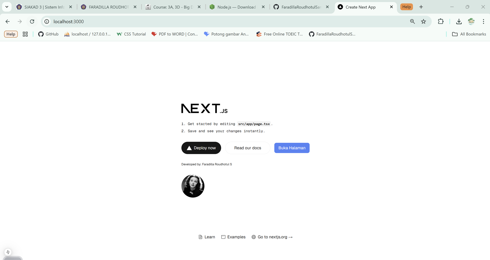